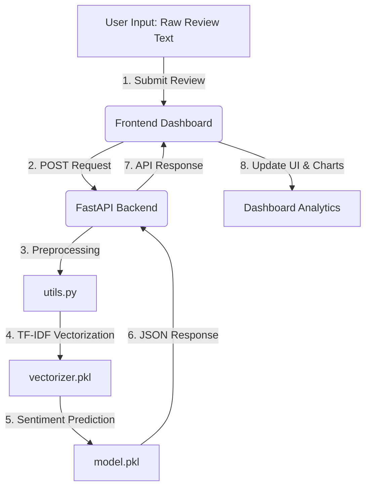

# 🔮 ReviewSense — AI Sentiment Intelligence Dashboard

[](https://vercel.com)
[](https://render.com)
[](LICENSE)
[](https://fastapi.tiangolo.com)
[](https://scikit-learn.org)

ReviewSense is a production-level, high-performance AI Sentiment Intelligence dashboard designed to analyze, track, and visualize customer review polarities in real-time. Built with a futuristic glassmorphic UI design system, it features a modular architecture separating a clean client-side dashboard from a FastAPI machine learning prediction server.

---

## 🚀 Features

- **Futuristic Cinematic UI:** Implements custom glassmorphism design tokens, interactive ambient canvas particles, smooth SVG neon animations, and responsive dashboards.
- **Real-Time Sentiment Classification:** Predicts `Positive`, `Negative`, and `Neutral` sentiments with precision probability confidence metrics.
- **Dynamic Metrics Engine:** Live trackers indicating **Total Analyses**, **Positive Rate**, **Average Confidence**, and **Reviews Today** with zero state layouts.
- **Bezier Trend Charts:** Canvas-rendered weekly data charting curves showing sentiment distribution movements.
- **Local Persistence:** Retains full application states, analysis histories, and daily stats charts between page loads using `localStorage`.
- **Flexible Cross-Origin Operations:** Built-in CORS routing on the backend API allowing multi-domain web communication (e.g. Vercel frontend + Render backend).
- **Intelligent API Config Resolver:** Automatically switches between dev localhost endpoints and deployed cloud hosts depending on the environment.
- **Robust Exception Handling:** Integrated `AbortController` request timeout monitoring and detailed network exception visual alerts.

---

## 🛠️ Tech Stack

### Frontend
- **Structure:** Semantic HTML5
- **Styling:** Custom Vanilla CSS3 (Custom Variables, Keyframe Animations, Glassmorphism Filters)
- **Logic:** Vanilla ES6+ JavaScript (Canvas Engine, Fetch API, LocalStorage, AbortController)

### Backend
- **Framework:** FastAPI (Python 3.10+)
- **Machine Learning:** Scikit-Learn
- **NLP:** TF-IDF Vectorization + Logistic Regression
- **Libraries:** Pandas, NumPy, NLTK
- **Server:** Uvicorn

---

## 🏛️ System Architecture



---

## 📂 Folder Structure

```text
ReviewSense/
│
├── frontend/
│   ├── index.html
│   ├── style.css
│   ├── script.js
│   ├── config.js
│   │
│   ├── assets/
│   │   ├── icons/
│   │   ├── images/
│   │   ├── fonts/
│   │   └── animations/
│   │
│   └── components/
│
├── backend/
│   ├── app.py
│   ├── train_model.py
│   ├── utils.py
│   ├── model.pkl
│   ├── vectorizer.pkl
│   ├── requirements.txt
│   ├── Procfile
│   ├── .env.example
│   │
│   └── dataset/
│       └── reviews.csv
│
├── README.md
├── .gitignore
└── LICENSE
```

---

## 🔧 Installation & Local Setup

### Prerequisites

- Python 3.9+
- Modern Web Browser
- Git

---

## ⚙️ Backend Setup

### 1. Navigate to Backend

```bash
cd backend
```

### 2. Create Virtual Environment

#### Windows

```powershell
python -m venv venv
.\venv\Scripts\Activate.ps1
```

#### macOS/Linux

```bash
python3 -m venv venv
source venv/bin/activate
```

### 3. Install Dependencies

```bash
pip install -r requirements.txt
```

### 4. Train ML Model (Optional)

```bash
python train_model.py
```

### 5. Start FastAPI Server

```bash
uvicorn app:app --reload --host 127.0.0.1 --port 8000
```

Backend API:
```text
http://127.0.0.1:8000
```

Swagger Docs:
```text
http://127.0.0.1:8000/docs
```

---

## 💻 Frontend Setup

### Run Local Frontend Server

```bash
cd frontend
python -m http.server 3000
```

Open:
```text
http://localhost:3000
```

---

## 🌐 API Endpoint Usage

### Predict Sentiment

#### Endpoint

```http
POST /predict
```

#### Request

```json
{
  "review": "This product is amazing!"
}
```

#### Response

```json
{
  "sentiment": "Positive",
  "confidence": 98.42
}
```

---

## ☁️ Deployment Guide

### Frontend Deployment (Vercel)

1. Import GitHub repository into Vercel.
2. Configure:
   - Framework Preset → `Other`
   - Root Directory → `frontend`
3. Deploy.

---

### Backend Deployment (Render)

1. Create a new Web Service on Render.
2. Connect your GitHub repository.
3. Configure:
   - Runtime → `Python 3`
   - Root Directory → `backend`
   - Build Command →
     ```bash
     pip install -r requirements.txt
     ```
   - Start Command →
     ```bash
     uvicorn app:app --host 0.0.0.0 --port 10000
     ```

---


## 🔗 Live Deployment

### Frontend
```text
https://your-vercel-app.vercel.app
```

### Backend API
```text
https://reviewsense-ic19.onrender.com
```

---

## 🤝 Contributing

Contributions are welcome.

### Steps

```bash
git fork
git checkout -b feature/amazing-feature
git commit -m "Added amazing feature"
git push origin feature/amazing-feature
```

Then open a Pull Request.

---

## 🔮 Future Improvements

- Transformer Models (BERT / DistilBERT)
- Database Integration
- CSV Bulk Uploads
- User Authentication
- Real-Time Analytics Engine
- Admin Dashboard
- Multi-language Sentiment Detection

---

## 🌐 Deployment Note

This project uses **Render's free hosting tier** for the FastAPI backend.  
Because free instances automatically go to sleep after inactivity, the **first prediction request may take around 30–60 seconds** while the server wakes up.

✨ Once the backend becomes active, all subsequent requests respond much faster with normal real-time performance.

---

## 💳 Credits

Developed by **Samarth Talwar**
---
<p align="center">
  <b>⚡ Project by Samarth Talwar ⚡</b>
</p>
